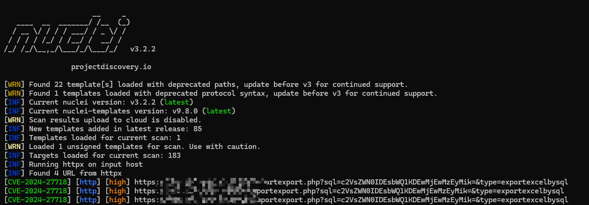

## WHAT'S THIS?


百卓 Smart管理平台是北京百卓网络技术有限公司(以下简称百卓网络)的一款安全网关产品，是一家致力于构建下一代安全互联网的高科技企业。

百卓Smart管理平台 importexport.php 接口存在SQL注入漏洞。恶意攻击者可能利用此漏洞获取服务器敏感信息，最终导致服务器失陷。


## HOW TO USE?


```bash
nuclei.exe -list ./cve-2024-27718/urls.txt -t ./cve-2024-27718/cve-2024-27718.yaml
```




